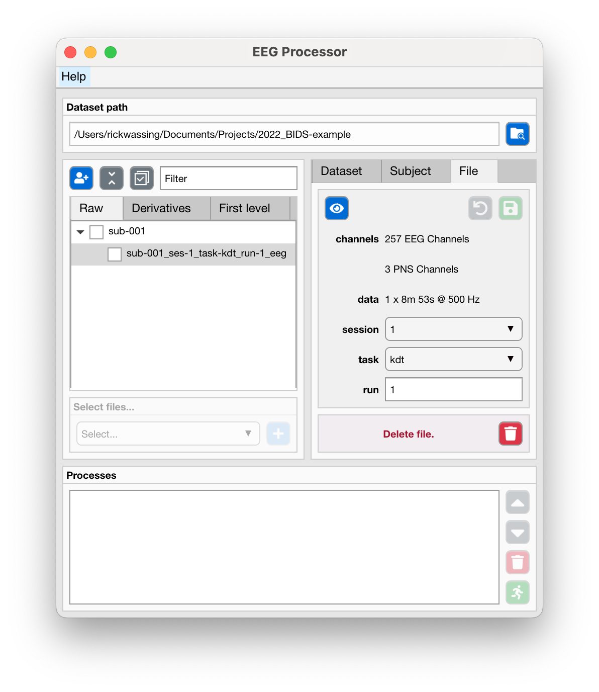
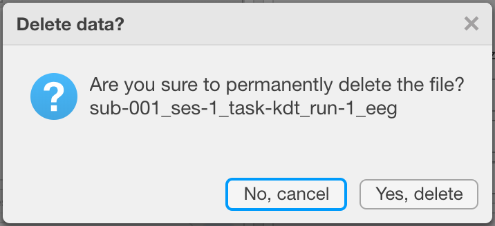

**EDIT FILES AND APPLY PROCESSES**

In this section you'll see how you can edit the name of a file and the general way you can apply processes to files.

:Video chapters:

    0:00 Managing filenames

    5:10 Delete files

    6:30 Applying processes to files

.. raw:: html

    <iframe width="560" height="315" src="https://www.youtube.com/embed/QWFWL9MQ-mA" title="YouTube video player" frameborder="0" allow="accelerometer; autoplay; clipboard-write; encrypted-media; gyroscope; picture-in-picture" allowfullscreen></iframe>

----

==============
Edit file name
==============

The name of a file in the BIDS is determined by a set of stringent `rules and specifications <https://bids-specification.readthedocs.io/en/stable/02-common-principles.html#file-name-structure>`_. The filename is build-up of ``key`` and ``value`` pairs, separated by dashes (-), and these key-value pairs are concatenated by underscores (_).

- In the middle right "File" tab, use the dropdown menus and the input fields to change the filename. You will notice that the file in the files-tree will now show (unsaved) behind its name. 
- Use the "Save" button to confirm these changes, at which point the actual file-on-disk will be renamed. Or use the "Undo" button to revert back to the original filename.

----

====================
Delete a single file
====================

- Select a single file in the files-tree in the left center tab.
- Use the "Delete file" button to delete the file.
- A dialog will appear to confirm or abort your action.

----

========================
Apply processes to files
========================

- Either
    - Use the checkboxes next to files to select individual files.
    - Use the checkboxes next to subjects to select all files associated with that subject.
    - Use the "select all"/"deselect all" button to select all files currently in view. You can change the files in view by entering an expression in the "Filter" input field, e.g. ``task-psg`` will show all files with that expression in their filename.
- Use the dropdown menu in the "Apply processes" panel to select a process you want to apply to all selected files.
- Use the "Add process" button to add that process.
- Most processes require you to choose specific settings, in which case a new window will open. When ready, click "Add processes".
- All processes now appear in the processes queque. Use the "Run" button to run all processes.

----