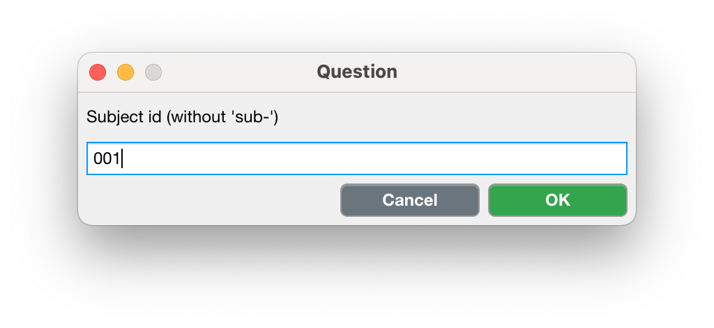
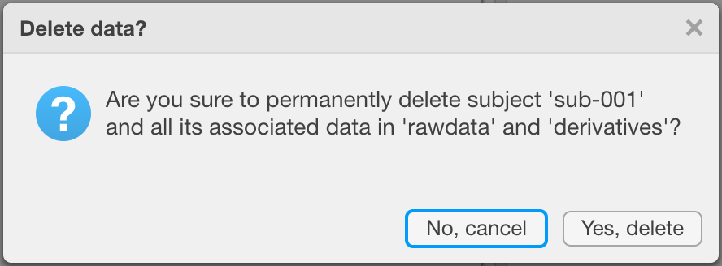
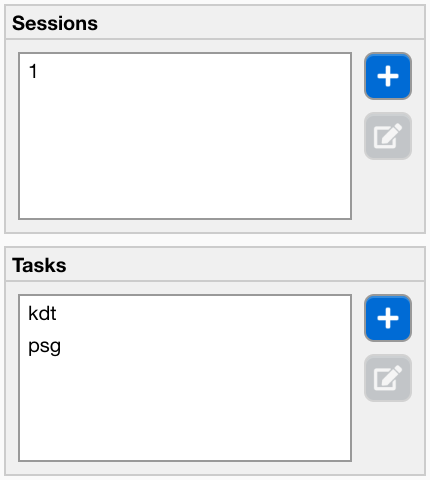
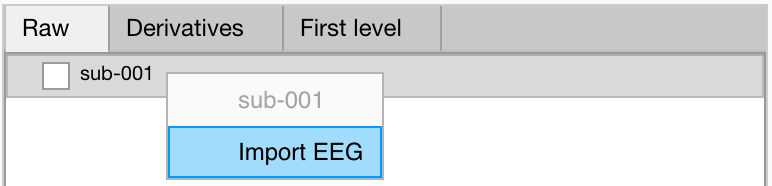
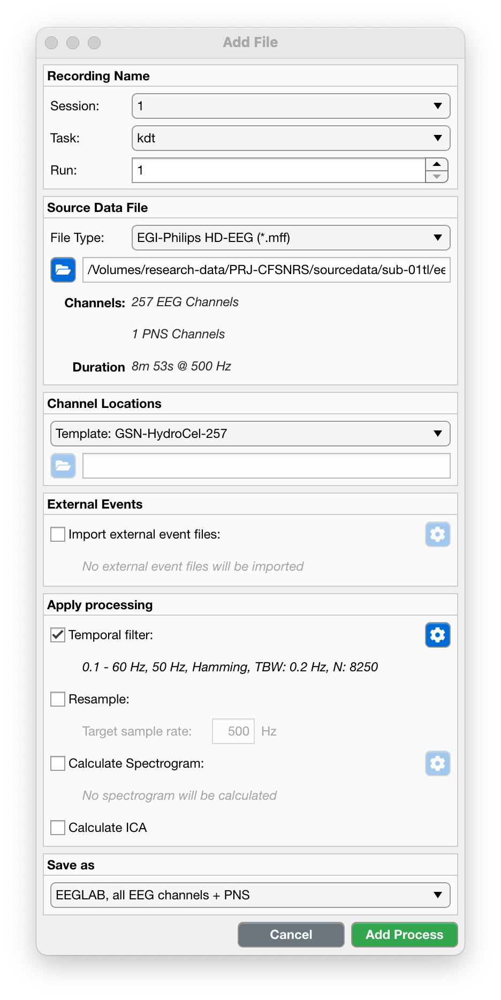
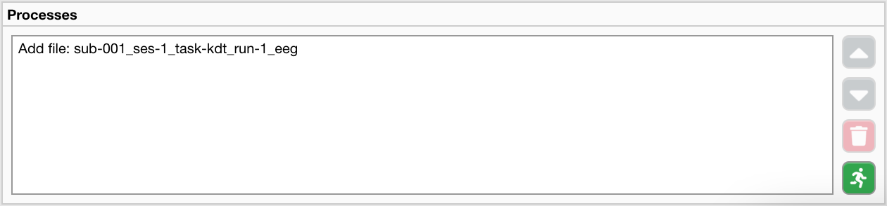
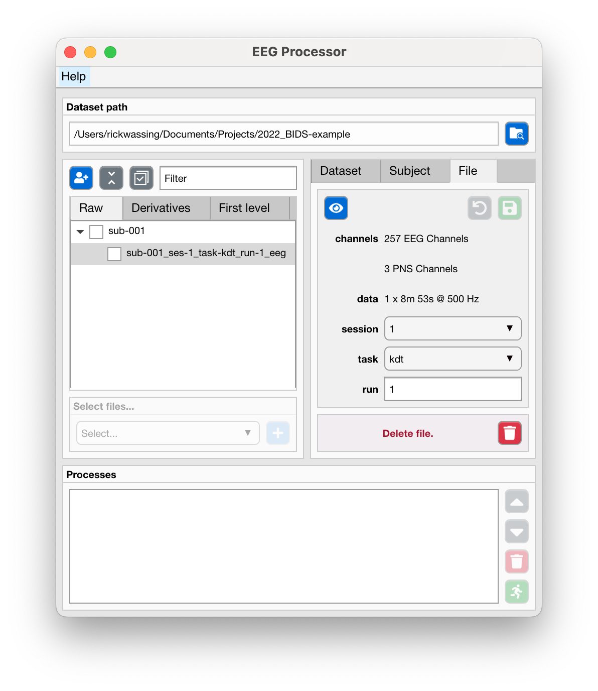

**MY FIRST SUBJECT AND FILE**

In this section you'll see how you can create your first subject and import your first file.

:Video chapters:

    0:00 Source data

    2:23 Create a new subject

    4:29 Create sessions and tasks

    6:21 Import an EEG recording
    
    18:35 Processes and run!
    
    19:19 Output files

.. raw:: html

    <iframe width="560" height="315" src="https://www.youtube.com/embed/s5PWy6mjg9s" title="YouTube video player" frameborder="0" allow="accelerometer; autoplay; clipboard-write; encrypted-media; gyroscope; picture-in-picture" allowfullscreen></iframe>

----

====================
Create a new subject
====================

- Use the "Add subject" button to open a new dialog where you can specify the subject-ID. Do not add the ``sub-`` prefix, just the subject-ID. Press "OK" to confirm, or "Cancel" to abort.

  
----

========================
Edit an existing subject
========================

- Select a subject from the tree in the middle left panel.
- Change the subject-ID
- Use the "Save" button to commit the changes, or use the "Undo" button to revert back to the orignal subject-ID.

----

=====================================
Permanently delete files of a subject
=====================================

- Select a subject from the tree in the middle left panel.
- Use the "Delete" button to permanently delete all files of a single subject.
- A new dialog window will appear to confirm your action. Use the "Yes, delete" button to delete all files associated with this subject stored in the ``rawdata`` and ``derivatives`` folders, or use the "No, cancel" button to abort.

.. note::

    Only files in the 'rawdata' and 'derivatives' folders that are associated with the selected subject are permanently deleted. The EEG Processor will **never** touch any file in the 'sourcedata' folder.

----

==========================
Specify sessions and tasks
==========================

Before you import a new file, you must first make sure to specify the name of the session and the task. You can do this on the "Dataset" tab in the middle right panel: see the "Sessions" and "Tasks" panels. Sessions are often simply "1", "2", etc., or "baseline" and "followup" (or "bl" and "fu" for short). Tasks need to descriptive, and can also be "restingstate", or "psg". Please refer to the `BIDS Specification Common Principles <https://bids-specification.readthedocs.io/en/stable/02-common-principles.html>`_ for more information. 

- Use the "Add session" and "Add tasks" buttons to create new tasks.

----

=================
Import a new file
=================

- In the center left files panel, select the ``Raw`` tab.
- Right click on any subject node to open the menu.
- Select "Import EEG"

- A new dialog window opens where the following import settings need to be specified:

:Recording Name:

    **Session**

    Use the dropdown menu to select the session this recording belongs to.

    **Task**

    Use the dropdown menu to select the task performed during this recording.

    **Run**

    Enter the run number.

:Source Data File:

    **File Type**

    Use the dropdown menu to select

    - EGI-Philips HD-EEG (*.mff)
    - Compumedics HD-EEG (*.edf)
    - 10-20 Converted by EEG Processor (*.edf)

    **Path**

    Use the "Browse" button to select the ``source`` file to import.

:Channel Locations:

    **Channel File Type**

    There are either templates of the channel locations, or you can import a Geoscan file. Use the dropdown menu to select

    - Template: GSN-HydroCel-257 (for EGI-Philips HD-EEG)
    - Template: Compumedics-257 (for Compumedics HD-EEG)
    - Template: 10-20 (For 10-20 Converted by EEG Processor)
    - Import Geoscan

    **Channel Path**

    - If you selected "Import Geoscan", you must use the "Browse" button to select the Geoscan output file (.txt).

:External Events:

    **Import external event files**

    In addition to the events already stored in the EEG ``source`` file, you can also import events from specific external files.

    - Tick the checkbox to enable the import settings button.
    - Use the "Settings" button to open a new dialog.
    - In the new dialog, use the "Browse" buttons to select the 
        - Compumedics hypnogram file (.txt)
        - Compumedics scored-events file (.txt)
        - Wonambi events file (.xml)

:Apply Processing:

    **Temporal filter**

    - Tick the checkbox to apply a temporal filter (default on).
    - Use the "Settings" button to open a new dialog.
    - In the new dialog you can change the filter settings. Make sure that, within the frequency range of interest, the magnitude response and the phase response is zero.

    **Resample**

    - Tick the checkbox to resample the data (default off). If disk-size or RAM (Memory) are not an issue, it would be recommended to keep the original sampling rate.

    **Calculate spectrogram**

    - Tick the checkbox to calculate a spectrogram (default off). It may be useful to have the spectrogram while visually inspecting artefacts, or scoring sleep events.
    - Use the "Settings" button to specify the parameters of the spectrogram.
        - First you must specify which channels to use in calculating the spectrogram, by clickin on any channel in the topoplot, or using the "All" button.
        - Specify other properties of the spectrogram algorithm.

    **Calculate ICA**

    - Tick the checkbox to perform independent component analysis on the data (default off). Note that ICA assumes the EEG timeseries to be stationary, i.e. that the underlying sources that generate the timeseries do not change or that they change their statistical dependencies.

:Save as:

    - Use the dropdown menu to select how you want to save the file.
        - "EEGLAB, all EEG channels + PNS": Save all EEG channels and physiology channels as a .SET/.FDT file.
        - "EDF, 12 EEG channels + EOG": Select and re-reference 12 channels and a EOG channel and save it as an EDF file.

.. warning::

    Although it may seem that the EEG Processor can import EDF files, it may not accurately handle **any** EDF file. The three specified formats (EGI, Compumedics, 10-20) have known data structures and the EEG Processor "knows" how to import them. Any other EDF may not have the expected data structure and may not import properly.

Ok, now you've specified all the import settings. What's next?

- Use the "Add Process" button to confirm the import settings, or use the "Cancel" button to abort.

You'll notice that the file is not yet imported. Instead it is added to the processes queue. This way, you can specify more processes, e.g. import more files, and run them all sequentially.

- Use the "Run" button to start importing the file.

Once all processes have finished, the EEG Processor will now show you the imported files.

----