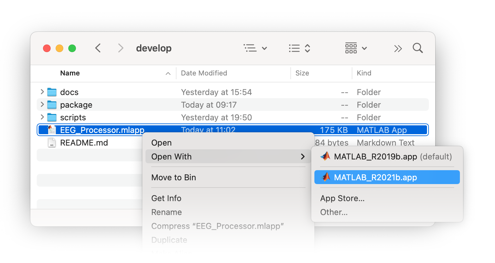
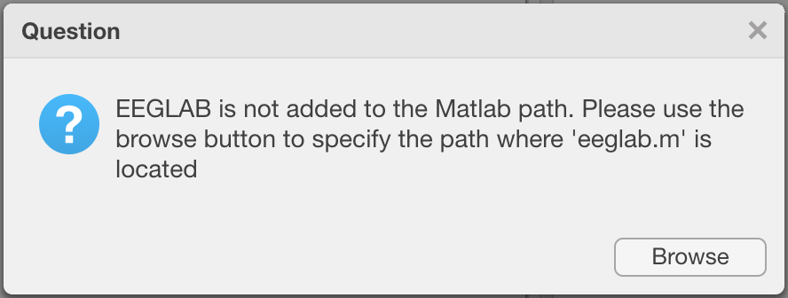
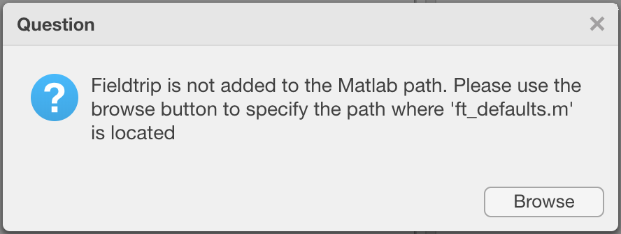
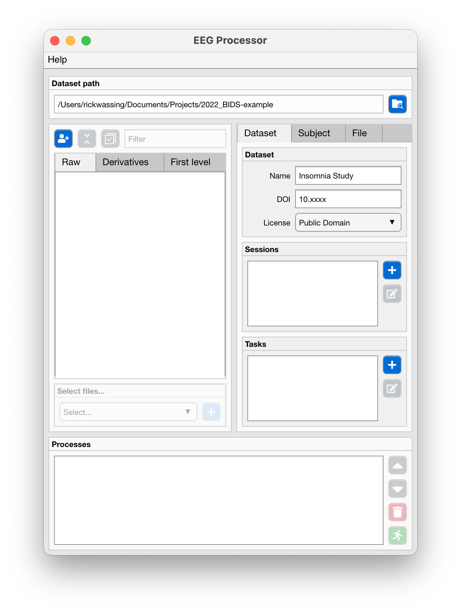
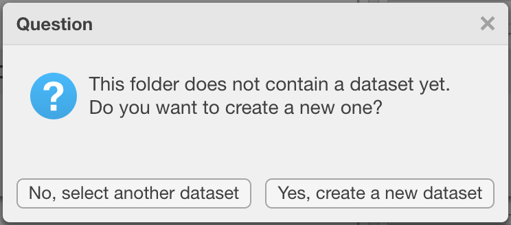
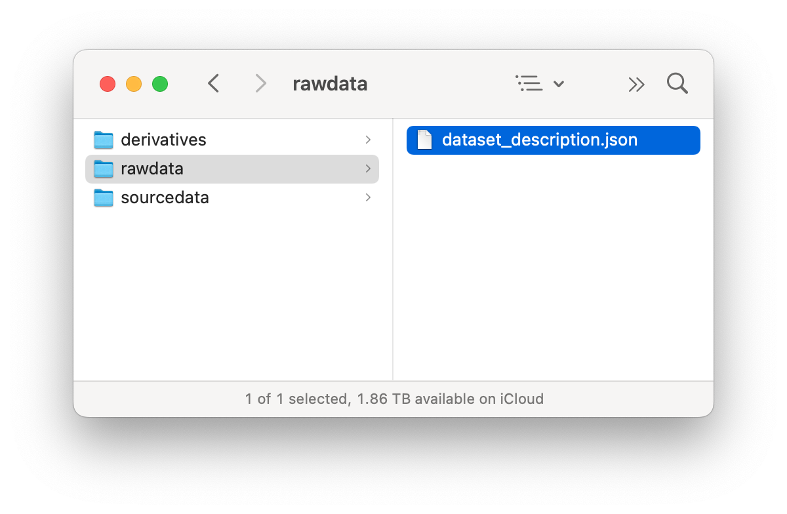
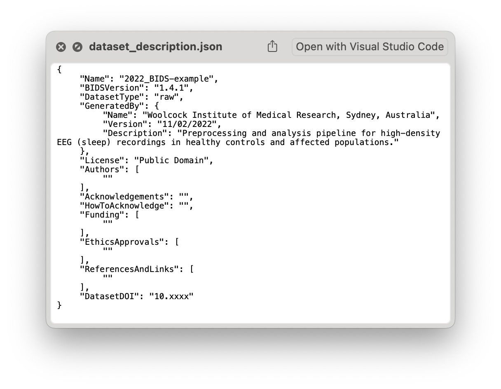

**GETTING STARTED**

In this first section you'll see how to open the EEG Processor application, how to setup a new dataset, and how to open an existing dataset.

:Video chapters:

    0:00 Download the EEG Processor
    
    1:11 Start the EEG Processor
    
    2:42 The interface
    
    5:00 Create new dataset

.. raw:: html

    <iframe width="560" height="315" src="https://www.youtube.com/embed/RjDMzMV1t3s" title="YouTube video player" frameborder="0" allow="accelerometer; autoplay; clipboard-write; encrypted-media; gyroscope; picture-in-picture" allowfullscreen></iframe>

----

===================================
Open the EEG Processor application
===================================

- Navigate to the location of the 'EEG_Processor.mlapp' file and make sure to open it with Matlab 2021a or later.

- If you run the EEG Processor on the Woolcock Super-Computer, then the dependencies of EEGLAB and Fieldtrip will be automatically added. 

    - Otherwise, you'll have to specify where EEGLAB and Fieldtrip are located on your computer. The following dialogs will show. Press "Browse" and navigate to the folder that contains 'eeglab.m' and 'ft_defaults.m' respectively.

----

============================
The EEG Processor interface
============================

:Top panel:
    **Dataset path**.
    Shows the path to the currently loaded dataset. Use the "Browse" button to select the BIDS dataset root directory, i.e. the location that contains the ``rawdata`` folder.
:middle left panel:
    **Files tabs**.
    Shows a tree of subjects and associated files stored in the ``rawdata``, the ``derivatives`` and the ``derivatives/*-first-level`` folders. Use the "Add subject" button to create a new subject, the "Collapse/Expand" button to collapse or expand the files-tree, the "Select/Deselect" button to select or deselect all shown files, and the "Filter" input field to filter files based on an expression, e.g. ``task_psg`` will only show files that contain that expression in the filename.
:middle right panel:
    **Properties tabs**.
    Shows the properties of the dataset description, the selected subject and the selected files. See below for more info. TODO: add link
:Bottom panels:
    **Apply process to selected files**.
    Use the dropdown menu to select a process, e.g. "Power Spectral Analysis" and then the "Add process" button to add the selected process for each selected file to the processes queue.
    **Processes**.
    Lists all processes in the queue. Use the "Up" and "Down" buttons to rearrange processes, the "Delete" button to remove processes, or the "Run" button to start the processes.

----

===========================
Creating a new BIDS dataset
===========================

- Use the "Browse" botton in the dataset path panel to select the folder where you want to create a new BIDS dataset.

    - If the selected folder does not contain a ``dataset_description.json`` file, nor does it contain a ``rawdata`` folder with such a JSON file in it, then it will ask if you want to create a new dataset or not. Select "Yes, create a new dataset"

- The BIDS dataset contains 3 main folders, 
    - the ``sourcedata`` folder contains data before harmonization, reconstruction, and/or file format conversion,
    - the ``rawdata`` folder contains unprocessed or minimally processed data, e.g. file format conversion,
    - the ``derivatives`` folder contains processed data and analysis output files.

- The ``rawdata`` folder contains the main ``dataset_description.json`` file. This plain text file is a tree-structered list of properties of the dataset. These properties can be changed via the EEG Processor application.

----

===============================
Set the BIDS dataset properties
===============================

Simply use the input fields to change any of the dataset properties.

.. note::

  The ``Sessions`` and ``Tasks`` panel are used for when you want to import a new file or select part of an existing file. Which will be discussed later. TODO: show link

:Dataset name:
    Name of your dataset or project.
:Dataset DOI:
    Full DOI link to the online repository of your dataset.
:Dataset License:
    License for use of your open-source dataset by others.
:Generated by:
    A name and description of who or what has created this dataset.
:Authors:
    Your name and others who worked on the project.
:Funding:
    Names of funding bodies and grant application IDs.
:Ethics:
    Name of the institute and ethics committee(s) that granted permission to perform the project.
:How to acknowledge:
    Short description of how others can acknowledge the use of your dataset, e.g. a publication.
:Acknowledgments:
    List of publications or documents that were used as prior knowledge in your project.

----